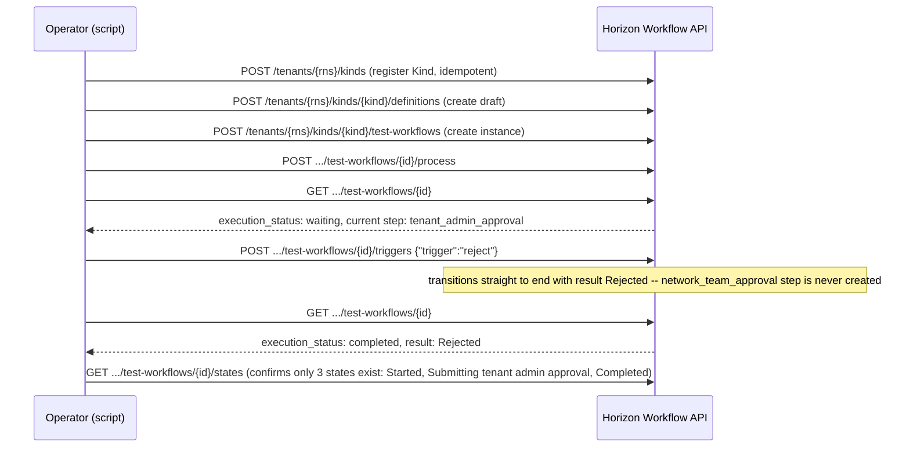
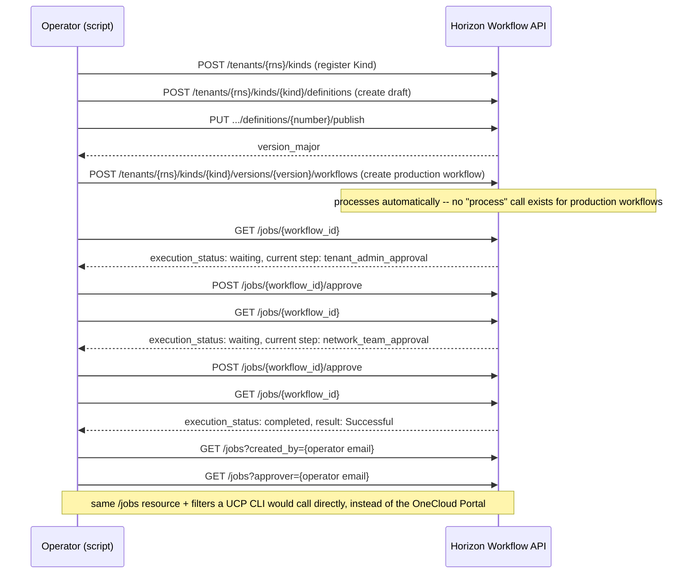

# horizon-workflow-approval-gate-poc

Spike for MCUCP-304: validates whether Horizon Workflow (OneCloud's WaaS
platform) can drive a two-layer approval chain — first the submitting
tenant's admins, then a fixed team (`clsd-ucp-team`) standing in for a real
network-team approver group.

The resume callback (Part B of the design) is deferred: every real callback
URL found in the research is an internal `r-local.net` service, and it's not
yet confirmed whether Workflow's QA backend can reach anything this script
could stand up. See the design doc for details.

Full design: `docs/projects/universal-control-plane-ucp/pocs/horizon-workflow-approval-gate/design.md`
in the UCP documentation repository. Evidence from real runs (both modes,
all three scenarios) is written up in `implementation.md` alongside it.

## Prerequisites

- VPN access to reach `qa-horizon-workflow-api.r-local.net` and the OneCloud
  QA Keycloak realm.
- Admin access to a QA OneCloud tenant (used as the submitting tenant for
  layer 1), and Admin access to the `clsd-ucp-team` Team (used for layer 2).
- The Workflow service subscribed, and **both** the `admin` and `creator`
  service roles granted to your account on that tenant (self-service via
  Tenant Management — see the Workflow onboarding guides). `admin` is
  required for Kind/definition management and for creating test workflows;
  `creator` is separately required to create **production** workflows
  (`MODE=production`) — `admin` alone is not enough for that.

## Running

```sh
KEYCLOAK_ISSUER=https://qa2-accounts-onecloud.rakuten-it.com/auth/realms/roc \
KEYCLOAK_CLIENT_ID=rns:roc:portal \
WORKFLOW_BASE_URL=https://qa-horizon-workflow-api.r-local.net \
TENANT_RNS=rns:roc:iam::<your-tenant> \
go run .
```

The script pauses before each approval layer so you can inspect state
in between if you want; it prints every request and response it makes.

### Modes (`MODE` env var)

- `test` (default): drives a **test workflow**, via the tenant-scoped
  `test-workflows` endpoints. No publishing required, and no real
  tenant-admin/team-admin role propagation is needed since test workflows
  support impersonation. Never appears in the OneCloud Portal.
- `production`: publishes the definition draft, creates a real
  **production workflow**, and drives it via the ABAC-scoped `/jobs`
  resource — the same resource the OneCloud Portal's Approvals/My Requests
  tabs are backed by. This is also the resource a UCP-native interface
  (e.g. a CLI) would call directly, using a bearer token from the same
  shared Keycloak realm, instead of requiring a Portal login.

### Scenarios (`SCENARIO` env var), same for both modes

- `happy` (default): approve layer 1, then approve layer 2 — ends `Successful`.
- `reject-layer1`: reject at layer 1 — ends `Rejected`, layer 2 never reached.
- `cancel-layer1`: cancel at layer 1 — ends `Canceled`, layer 2 never reached.

## What each scenario actually runs

### `test` + `happy`

```mermaid
sequenceDiagram
    participant Op as Operator (script)
    participant WF as Horizon Workflow API

    Op->>WF: POST /tenants/{rns}/kinds (register Kind)
    Op->>WF: POST /tenants/{rns}/kinds/{kind}/definitions (create draft)
    Op->>WF: POST /tenants/{rns}/kinds/{kind}/test-workflows (create instance)
    Op->>WF: POST .../test-workflows/{id}/process
    Note over WF: advances Start -> tenant_admin_approval (no automated nodes to cross)
    Op->>WF: GET .../test-workflows/{id}
    WF-->>Op: execution_status: waiting, current step: tenant_admin_approval
    Op->>WF: POST .../test-workflows/{id}/triggers {"trigger":"approve"}
    Note over WF: tenant_admin_approval resolves users dynamically from {{ params.tenant_rns }}; transitions to network_team_approval
    Op->>WF: GET .../test-workflows/{id}
    WF-->>Op: execution_status: waiting, current step: network_team_approval
    Op->>WF: POST .../test-workflows/{id}/triggers {"trigger":"approve"}
    Note over WF: network_team_approval resolves users from fixed team clsd-ucp-team; transitions to end
    Op->>WF: GET .../test-workflows/{id}
    WF-->>Op: execution_status: completed, result: Successful
    Op->>WF: GET .../test-workflows/{id}/states (full history, for evidence)
```

No `process` call happens after a trigger — each trigger's transition is
immediate and complete on its own; `process` is only for advancing through
automated nodes (callback/adapter), which this definition has none of.

### `test` + `reject-layer1` (same shape for `cancel-layer1`, action swapped)



### `production` + `happy`



The `production` mode is otherwise identical in shape to `test` — the only
differences are: a publish step happens first, workflow creation targets a
published `version` instead of a definition draft number, there's no
`process` call at all, and every action/status call targets `/jobs` instead
of the tenant-scoped `test-workflows` endpoints.

## Known gaps

- This script always acts as the logged-in operator for both approval
  layers (no impersonation), on the assumption that the operator is
  genuinely both the submitting tenant's admin and `clsd-ucp-team`'s admin.
  If that's not the case for a given run, impersonation support would need
  to be added.
- `production` mode creates a real, permanent Workflow Kind version and
  real workflow instances — these are not cleaned up by the script.
