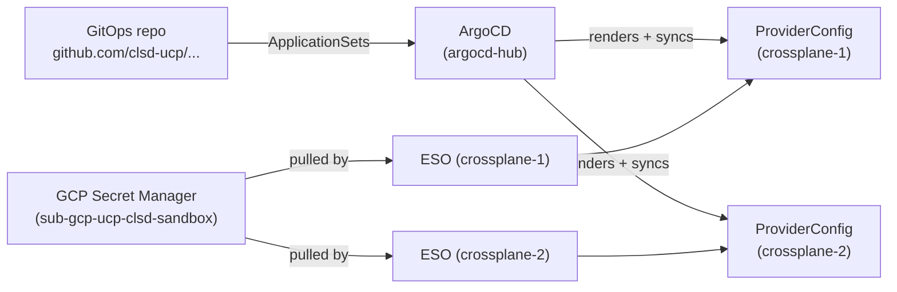

# Multi-Cluster ProviderConfig Sync PoC (MCUCP-306)

Validates whether an ArgoCD `ApplicationSet` matrix generator (cluster generator ×
tenant registry generator) automatically extends `ExternalSecret` + `ProviderConfig`
pairs to a newly added Crossplane cluster, with no new Git commit and no UCP backend
involvement.

Design doc: `docs/projects/universal-control-plane-ucp/pocs/multi-cluster-provider-config-sync/design.md`
in the `ucp-docs-collection` repo. PoC verdict: `poc-report.md` in the same directory.

GitOps source repo (chart + `ApplicationSet`s + tenant registry): `https://github.com/clsd-ucp/mcucp-306-provider-config-gitops`

**Status: validated end-to-end.** Two Crossplane clusters, real GCP Secret Manager
data flowing through ESO into a K8s `Secret`, a healthy `ProviderConfig` on both
clusters, and the second cluster backfilled automatically from a tenant registration
that already existed before that cluster was created.

---

## Prerequisites

| Requirement | Notes |
|---|---|
| macOS with Colima | `brew install colima docker k3d kubectl helm argocd` |
| `gcloud` CLI, authenticated | `gcloud auth login`. **On a Netskope-inspected corporate network, this fails with an SSL error before you even get to auth** — fix it first, see [`../gcloud-netskope-tls-fix/`](../gcloud-netskope-tls-fix/README.md) |
| `gh` CLI, authenticated to `github.com` | `gh auth login --hostname github.com`, needs write access to `github.com/clsd-ucp` |
| Access to the GCP project `sub-gcp-ucp-clsd-sandbox` | IAM permissions to create service accounts, grant IAM bindings, and create Secret Manager secrets |
| ~10GB free RAM | 3 k3s clusters + ArgoCD + Crossplane + provider pods, all in one Colima VM. Stop unrelated Colima profiles first (`colima list`, `colima stop --profile <name>`) if you're tight on memory — a `docker+k3s` profile failing to start with `did not receive an event with the "running" status` is usually this. |

---

## Architecture

```
Colima VM "mcucp-poc" (docker only, 4 CPU / 8GB)
└── Docker network: mcucp-poc-net
    ├── k3d cluster "argocd-hub"     (context: k3d-argocd-hub)   -- runs ArgoCD
    ├── k3d cluster "crossplane-1"   (context: k3d-crossplane-1) -- Crossplane + provider-gcp + ESO
    └── k3d cluster "crossplane-2"   (context: k3d-crossplane-2) -- same, added mid-PoC
```

ArgoCD (in `argocd-hub`) reaches the other two clusters' API servers at
`https://k3d-<cluster>-server-0:6443` — the k3d server container's name, resolved
via Docker's built-in DNS on the shared network. No VM networking is involved.

**Why not 3 separate Colima VMs, one per cluster?** That was the original plan and
it does not work: macOS's Virtualization.framework shared-network mode
(`--network-address`) assigns each VM a routable IP but isolates VM-to-VM traffic
(client isolation, like Wi-Fi AP isolation) — only VM↔host works. Bridged mode
(`--network-mode bridged`) also failed to get a DHCP lease on this corporate
network. Putting all three clusters in one VM's Docker network sidesteps this
entirely, since Docker's own bridge network has no such isolation.



---

## Quickstart

All scripts live in `scripts/` and are idempotent — safe to re-run.

```sh
cd scripts

./00-check-prereqs.sh

./01-bootstrap-environment.sh          # Colima VM, inotify fix, Docker network, ArgoCD hub

./02-create-cluster.sh crossplane-1 6551
./03-register-cluster-with-argocd.sh crossplane-1
./04-install-crossplane.sh crossplane-1

./05-setup-gcp-secret-manager-access.sh create-sa
./05-setup-gcp-secret-manager-access.sh install-key crossplane-1

./06-apply-platform-appsets.sh         # installs ESO, ClusterSecretStore, and the
                                        # tenant matrix ApplicationSet on every
                                        # registered+labeled cluster

./07-onboard-tenant.sh acme acme-proj-123 123456789012 \
    acme-proj-123@proj-123.iam.gserviceaccount.com proj-123
    #  ^tenant  ^registration  ^gcp-project-number  ^gcp-sa-email  ^gcp-project-id (optional)

# --- watch it land on cluster 1 ---
source lib.sh && argocd_cli_login
argocd app list

# --- add a second cluster and watch the SAME registration backfill with
#     zero new commits ---
./02-create-cluster.sh crossplane-2 6552
./03-register-cluster-with-argocd.sh crossplane-2
./04-install-crossplane.sh crossplane-2
./05-setup-gcp-secret-manager-access.sh install-key crossplane-2
argocd app list   # pc-acme-proj-123-crossplane-2 appears on its own

./08-verify-environment.sh crossplane-1 crossplane-2   # full PASS/FAIL health check
```

Teardown: `./99-teardown.sh` (deletes the local clusters/VM; does not touch the GCP
service account, GCP secrets, or the GitHub repo — see script comments).

---

## Manual walkthrough (no scripts)

Same sequence as the Quickstart, as literal commands, for adapting a step or
debugging without going through `scripts/`. Uses the same values the scripts
default to (`sub-gcp-ucp-clsd-sandbox`, `mcucp-306-eso-poc`,
`github.com/clsd-ucp/mcucp-306-provider-config-gitops`) — substitute your own.

### 1. Environment

```sh
colima start --profile mcucp-poc --cpu 4 --memory 8 --disk 40
docker context use colima-mcucp-poc

# only needed once, if k3d cluster create fails with "inotify_init: too many open files"
colima ssh --profile mcucp-poc -- sudo sh -c "
  sysctl -w fs.inotify.max_user_instances=8192
  echo 'fs.inotify.max_user_instances=8192' >> /etc/sysctl.conf
  mkdir -p /etc/systemd/system.conf.d
  printf '[Manager]\nDefaultLimitNOFILE=1048576\n' > /etc/systemd/system.conf.d/limits.conf
"
colima stop --profile mcucp-poc
colima start --profile mcucp-poc --cpu 4 --memory 8 --disk 40
docker context use colima-mcucp-poc

docker network create mcucp-poc-net

k3d cluster create argocd-hub --network mcucp-poc-net --api-port 6550 \
  -p "8080:80@loadbalancer" --wait --timeout 180s
```

**Verify:**

```sh
colima list                                    # mcucp-poc: Running
docker network inspect mcucp-poc-net           # exits 0
kubectl --context k3d-argocd-hub get --raw /healthz   # ok
```

### 2. ArgoCD on the hub

```sh
kubectl --context k3d-argocd-hub create namespace argocd
kubectl --context k3d-argocd-hub apply -n argocd \
  -f https://raw.githubusercontent.com/argoproj/argo-cd/stable/manifests/install.yaml \
  --server-side --force-conflicts
kubectl --context k3d-argocd-hub wait --for=condition=Available deployment --all -n argocd --timeout=180s
```

**Verify:**

```sh
kubectl --context k3d-argocd-hub -n argocd get pods
# every pod Running/Ready, including argocd-application-controller-0

kubectl --context k3d-argocd-hub -n argocd get secret argocd-initial-admin-secret
# exists -- this is the admin password for both the CLI and the web UI, see
# "ArgoCD Web UI" below
```

### 3. Create and register a Crossplane cluster

```sh
NAME=crossplane-1
API_PORT=6551

k3d cluster create "$NAME" --network mcucp-poc-net --api-port "$API_PORT" --wait --timeout 180s

# service account + token on the target cluster
kubectl --context "k3d-$NAME" create serviceaccount argocd-manager -n kube-system
kubectl --context "k3d-$NAME" create clusterrolebinding argocd-manager-cluster-admin \
  --clusterrole=cluster-admin --serviceaccount=kube-system:argocd-manager
kubectl --context "k3d-$NAME" apply -f - <<EOF
apiVersion: v1
kind: Secret
metadata:
  name: argocd-manager-token
  namespace: kube-system
  annotations:
    kubernetes.io/service-account.name: argocd-manager
type: kubernetes.io/service-account-token
EOF
TOKEN=$(kubectl --context "k3d-$NAME" -n kube-system get secret argocd-manager-token \
  -o jsonpath='{.data.token}' | base64 -d)

# cluster Secret on the hub, using the Docker-network-resolvable address
kubectl --context k3d-argocd-hub apply -f - <<EOF
apiVersion: v1
kind: Secret
metadata:
  name: cluster-${NAME}
  namespace: argocd
  labels:
    argocd.argoproj.io/secret-type: cluster
    mcucp.io/role: crossplane
type: Opaque
stringData:
  name: ${NAME}
  server: https://k3d-${NAME}-server-0:6443
  config: |
    { "bearerToken": "${TOKEN}", "tlsClientConfig": { "insecure": true } }
EOF
```

**Verify:**

```sh
kubectl --context "k3d-$NAME" get --raw /healthz              # ok -- cluster itself is up

argocd cluster list
# SERVER https://k3d-<name>-server-0:6443  NAME <name>  STATUS Successful

kubectl --context k3d-argocd-hub -n argocd get secret "cluster-${NAME}" \
  -o jsonpath='{.metadata.labels}'
# includes "mcucp.io/role":"crossplane" -- if this label is missing, the
# platform ApplicationSets in step 6 won't pick this cluster up at all
```

`argocd cluster list` needs `argocd login` first (see step 8) if you haven't
logged in yet this session.

### 4. Crossplane + provider-gcp on that cluster

```sh
helm repo add crossplane-stable https://charts.crossplane.io/stable
kubectl --context "k3d-$NAME" create namespace crossplane-system
helm --kube-context "k3d-$NAME" install crossplane crossplane-stable/crossplane \
  -n crossplane-system --wait --timeout 180s

kubectl --context "k3d-$NAME" apply -f - <<'EOF'
apiVersion: pkg.crossplane.io/v1
kind: Provider
metadata:
  name: provider-gcp
spec:
  package: xpkg.upbound.io/upbound/provider-family-gcp:v2.6.0
EOF
# wait for: kubectl --context k3d-crossplane-1 get providers.pkg.crossplane.io provider-gcp
#           -o jsonpath='{.status.conditions[?(@.type=="Healthy")].status}'  ->  True
```

**Verify:**

```sh
kubectl --context "k3d-$NAME" -n crossplane-system get deployment crossplane
# 1/1 Ready

kubectl --context "k3d-$NAME" get providers.pkg.crossplane.io provider-gcp
# INSTALLED=True  HEALTHY=True

kubectl --context "k3d-$NAME" api-resources | grep -i providerconfig
# providerconfigs   gcp.upbound.io/v1beta1   -- only appears once provider-gcp
# is healthy; anything rendered before this point fails with "the server
# could not find gcp.upbound.io/ProviderConfig"
```

### 5. GCP service account for ESO, and its key on the cluster

```sh
gcloud iam service-accounts create mcucp-306-eso-poc \
  --project sub-gcp-ucp-clsd-sandbox \
  --display-name "MCUCP-306 ESO PoC (Secret Manager reader)"

gcloud projects add-iam-policy-binding sub-gcp-ucp-clsd-sandbox \
  --member="serviceAccount:mcucp-306-eso-poc@sub-gcp-ucp-clsd-sandbox.iam.gserviceaccount.com" \
  --role="roles/secretmanager.secretAccessor" --condition=None

gcloud iam service-accounts keys create /tmp/eso-key.json \
  --iam-account=mcucp-306-eso-poc@sub-gcp-ucp-clsd-sandbox.iam.gserviceaccount.com

kubectl --context "k3d-$NAME" create namespace external-secrets
kubectl --context "k3d-$NAME" -n external-secrets create secret generic eso-gcp-sm-key \
  --from-file=key.json=/tmp/eso-key.json
rm /tmp/eso-key.json
```

**Verify:**

```sh
gcloud iam service-accounts describe mcucp-306-eso-poc@sub-gcp-ucp-clsd-sandbox.iam.gserviceaccount.com
# exists

gcloud projects get-iam-policy sub-gcp-ucp-clsd-sandbox \
  --flatten="bindings[].members" --format='table(bindings.role)' \
  --filter="bindings.members:mcucp-306-eso-poc@*"
# roles/secretmanager.secretAccessor listed

kubectl --context "k3d-$NAME" -n external-secrets get secret eso-gcp-sm-key
# exists (key.json data key)
```

### 6. GitOps repo credential and platform ApplicationSets

```sh
git clone https://github.com/clsd-ucp/mcucp-306-provider-config-gitops.git /tmp/mcucp-306-gitops

kubectl --context k3d-argocd-hub -n argocd create secret generic repo-mcucp-306-gitops \
  --from-literal=type=git \
  --from-literal=url=https://github.com/clsd-ucp/mcucp-306-provider-config-gitops.git \
  --from-literal=username="$(gh api user -q .login --hostname github.com)" \
  --from-literal=password="$(GH_HOST=github.com gh auth token)"
kubectl --context k3d-argocd-hub -n argocd label secret repo-mcucp-306-gitops \
  "argocd.argoproj.io/secret-type=repository"

kubectl --context k3d-argocd-hub apply -f /tmp/mcucp-306-gitops/gitops/platform/eso-appset.yaml
kubectl --context k3d-argocd-hub apply -f /tmp/mcucp-306-gitops/gitops/platform/clustersecretstore-appset.yaml
kubectl --context k3d-argocd-hub apply -f /tmp/mcucp-306-gitops/gitops/tenant-matrix-appset.yaml
```

**Verify:**

```sh
kubectl --context k3d-argocd-hub -n argocd get applicationsets.argoproj.io
# platform-eso, platform-clustersecretstore, tenant-provider-config-matrix all present

argocd app list
# eso-<name> and clustersecretstore-<name> Synced/Healthy for every registered
# cluster -- no tenant Applications yet, since the registry is still empty

kubectl --context "k3d-$NAME" -n external-secrets get deployment external-secrets
kubectl --context "k3d-$NAME" get clustersecretstore gcp-secret-manager
# Deployment Ready, ClusterSecretStore STATUS=Valid, READY=True
```

### 7. Onboard a tenant

The Secret Manager payload is the real WIF `external_account` credential config
JSON (the shape validated in the `wif-gcp` PoC), not a flat stand-in — the target
GCP service account lives inside `service_account_impersonation_url`, not as a
bare field:

```sh
TENANT=acme; REG_ID=acme-proj-123
GCP_PROJECT_NUMBER=123456789012   # real project's number, or any placeholder for a fictional tenant project
GCP_PROJECT_ID=proj-123           # literal value for ProviderConfig.spec.projectID
GCP_SA="acme-proj-123@proj-123.iam.gserviceaccount.com"
WIF_POOL_ID=ucp-wif-pool          # fixed UCP-wide onboarding convention, not tenant-specific
WIF_PROVIDER_ID=ucp-k8s-provider

cat > /tmp/credentials.json <<EOF
{
  "type": "external_account",
  "audience": "//iam.googleapis.com/projects/${GCP_PROJECT_NUMBER}/locations/global/workloadIdentityPools/${WIF_POOL_ID}/providers/${WIF_PROVIDER_ID}",
  "subject_token_type": "urn:ietf:params:oauth:token-type:jwt",
  "token_url": "https://sts.googleapis.com/v1/token",
  "service_account_impersonation_url": "https://iamcredentials.googleapis.com/v1/projects/-/serviceAccounts/${GCP_SA}:generateAccessToken",
  "credential_source": {
    "file": "/var/run/secrets/tokens/gcp-token",
    "format": { "type": "text" }
  }
}
EOF
gcloud secrets create "${REG_ID}-config" --project sub-gcp-ucp-clsd-sandbox \
  --replication-policy automatic --data-file /tmp/credentials.json
rm /tmp/credentials.json

# registry entry: no credential material, no copy of anything inside the
# secret payload above -- gcpProjectId is the one exception, since Crossplane
# requires it as a literal ProviderConfig.spec field regardless of source.
cat > "/tmp/mcucp-306-gitops/registry/${REG_ID}.json" <<EOF
{
  "tenant": "${TENANT}",
  "registrationId": "${REG_ID}",
  "gcpProjectId": "${GCP_PROJECT_ID}",
  "secretManagerSecretName": "${REG_ID}-config"
}
EOF
git -C /tmp/mcucp-306-gitops add "registry/${REG_ID}.json"
git -C /tmp/mcucp-306-gitops commit -m "feat: onboard ${TENANT} registration ${REG_ID}"
git -C /tmp/mcucp-306-gitops push
```

**Verify:**

```sh
gcloud secrets versions access latest --secret="${REG_ID}-config" --project sub-gcp-ucp-clsd-sandbox
# prints the external_account JSON

GH_HOST=github.com gh api "repos/clsd-ucp/mcucp-306-provider-config-gitops/contents/registry/${REG_ID}.json" \
  -q '.content' | base64 -d
# prints the registry entry -- confirm it has NO service_account_impersonation_url
# or anything else from the secret above
```

The matrix `ApplicationSet`'s git generator polls on its own schedule (a few
minutes) — the checks in step 8 below are what confirm it actually landed.

### 8. Check it landed, then add a second cluster

```sh
kubectl --context k3d-argocd-hub -n argocd port-forward svc/argocd-server 8443:443 &
PW=$(kubectl --context k3d-argocd-hub -n argocd get secret argocd-initial-admin-secret \
  -o jsonpath='{.data.password}' | base64 -d)
argocd login localhost:8443 --username admin --password "$PW" --insecure
argocd app list
```

**Verify:**

```sh
argocd app list
# pc-<registration-id>-<cluster> Synced/Healthy

kubectl --context "k3d-$NAME" -n crossplane-system get externalsecret "${REG_ID}-config"
# STATUS=SecretSynced, READY=True

kubectl --context "k3d-$NAME" -n crossplane-system get secret "${REG_ID}-config" \
  -o jsonpath='{.data.credentials\.json}' | base64 -d
# the full external_account JSON, matching what's in Secret Manager

kubectl --context "k3d-$NAME" get providerconfig.gcp.upbound.io "${REG_ID}"
# exists
```

Repeat steps 3–5 with `NAME=crossplane-2` / `API_PORT=6552` and no changes to
steps 6–7 — `pc-acme-proj-123-crossplane-2` appears in `argocd app list` on its
own once the matrix `ApplicationSet` next reconciles. Run the same step-8
verify commands against `crossplane-2` to confirm the backfill actually
produced working resources, not just an `Application` object.

Or run all of the above in one shot: `./08-verify-environment.sh crossplane-1 crossplane-2`
(see [Verifying everything at once](#verifying-everything-at-once) below).

---

## Verifying everything at once

`08-verify-environment.sh [cluster-name ...]` runs every check from the Manual
walkthrough above against whatever's currently running, and prints PASS/FAIL
per check — safe to run at any point, including partway through setup:

```sh
./08-verify-environment.sh crossplane-1 crossplane-2
```

```
=== Environment ===
PASS  Colima VM 'mcucp-poc' is running
PASS  Docker network 'mcucp-poc-net' exists

=== ArgoCD hub ===
PASS  Hub cluster API server reachable
PASS  ArgoCD namespace exists
PASS  argocd-server deployment Available
PASS  argocd-application-controller running

=== Cluster: crossplane-1 ===
PASS  Cluster API server reachable
PASS  Registered with ArgoCD (labeled mcucp.io/role=crossplane)
PASS  Crossplane core installed
PASS  provider-gcp Healthy
PASS  ESO deployment running
PASS  eso-gcp-sm-key Secret present
PASS  ClusterSecretStore Valid

=== Cluster: crossplane-2 ===
... (same checks) ...

=== ArgoCD Applications ===
NAME                              SYNC     HEALTH
clustersecretstore-crossplane-1   Synced   Healthy
...

=== Tenant registrations ===
PASS  externalsecret.external-secrets.io/acme-proj-123-config SecretSynced on crossplane-1
PASS  providerconfig.gcp.upbound.io/acme-proj-123 exists on crossplane-1
...

=== Result: 24 passed, 0 failed ===
```

A `FAIL` line prints the first 3 lines of the underlying command's error output
directly beneath it — usually enough to tell you which earlier step to re-check.

---

## ArgoCD Web UI

ArgoCD has a full web UI, served by the same `argocd-server` Deployment the CLI
talks to — no separate install:

```sh
kubectl --context k3d-argocd-hub -n argocd port-forward svc/argocd-server 8080:443
```

Open `https://localhost:8080` (self-signed cert — accept the browser warning).
Username `admin`, password from:

```sh
kubectl --context k3d-argocd-hub -n argocd get secret argocd-initial-admin-secret \
  -o jsonpath='{.data.password}' | base64 -d
```

Useful for watching `ApplicationSet` → `Application` fan-out visually (the
Applications tree view shows every generated `Application` and its live sync
status), and for inspecting a specific `Application`'s resource tree
(`ExternalSecret` → `Secret` → `ProviderConfig`) without separate `kubectl`
calls per object. Same port-forward + credential the CLI login in step 8 uses —
run both against the same forwarded port if you want CLI and UI open at once
(`8443` for CLI examples above, `8080` here, or reuse either port for both).

---

## What each script does, and why

### `01-bootstrap-environment.sh`

Starts the Colima VM, creates the shared Docker network, creates the ArgoCD hub
cluster, and installs ArgoCD.

**Inotify limits.** Running 3 k3s clusters' worth of containers in one VM exhausts
the default `fs.inotify.max_user_instances` (128 on a stock Colima VM) —
`k3d cluster create` fails with `inotify_init: too many open files` deep in the
kubelet logs. The script bumps this to 8192 and persists it via `/etc/sysctl.conf`
and a `systemd/system.conf.d` file, then restarts the VM once (Docker containers
survive the restart automatically, no need to recreate anything).

**CRD size.** Plain `kubectl apply -f install.yaml` on the stock ArgoCD manifest
fails: the `applicationsets.argoproj.io` CRD's `last-applied-configuration`
annotation exceeds Kubernetes' 262144-byte annotation limit. `--server-side
--force-conflicts` avoids computing that annotation entirely.

### `03-register-cluster-with-argocd.sh`

`argocd cluster add <context>` determines the target server address from the
local kubeconfig, which for a k3d cluster is `https://0.0.0.0:<host-port>` — only
reachable from the host machine, not from ArgoCD's pod running inside a different
k3d cluster's containers. So this script skips the CLI's cluster-add flow entirely
and does the two things that actually matter by hand:

1. Creates an `argocd-manager` ServiceAccount + `cluster-admin` binding + a
   long-lived token **on the target cluster**.
2. Creates the ArgoCD cluster `Secret` **on the hub**, with `server:
   https://k3d-<name>-server-0:6443` (the Docker-network-resolvable name) and
   `tlsClientConfig.insecure: true` (the k3s server's cert has no SAN for that
   hostname), plus the label `mcucp.io/role: crossplane` that scopes the platform
   `ApplicationSet`s' cluster generator so they don't also match ArgoCD's own
   `in-cluster` entry.

### `04-install-crossplane.sh`

The `ProviderConfig` CRD (`gcp.upbound.io/v1beta1`) only exists once
`provider-family-gcp` is installed and healthy. Any ArgoCD `Application`
rendering a `ProviderConfig` before that point fails with `the server could not
find gcp.upbound.io/ProviderConfig`. If you install Crossplane *after* an
`Application` already tried and failed to sync, force ArgoCD to notice the new
CRD with `argocd app get <app> --hard-refresh` before resyncing — its cached API
resource list goes stale otherwise.

### `05-setup-gcp-secret-manager-access.sh`

ESO needs its own GCP credential to read Secret Manager — separate from whatever
credential a tenant's `ProviderConfig` uses. On real infrastructure (GKE), ESO's
`ClusterSecretStore` can use `workloadIdentity` auth (GKE Workload Identity,
metadata-server-based). **k3d clusters are not GKE** — there's no real GKE node
metadata to federate against, so `workloadIdentity` auth mode doesn't apply here.
This is the same limitation the `wif-gcp` PoC found for Crossplane's own provider
pod on a non-GKE cluster: the PoC-only stand-in is a stored service account key
(`secretRef` auth mode), and production runs on GKE where `workloadIdentity`
applies normally.

### `06-apply-platform-appsets.sh`

Clones the GitOps repo, sets up ArgoCD's Git credential (HTTPS + a `gh auth
token`-minted PAT — simpler than SSH deploy keys for a PoC), and applies:

- `platform-eso` — installs the `external-secrets` Helm chart on every cluster
  matching the `mcucp.io/role: crossplane` label.
- `platform-clustersecretstore` — installs the `ClusterSecretStore` manifest
  (`gitops/platform/manifests/clustersecretstore.yaml` in the GitOps repo) the
  same way.
- `tenant-provider-config-matrix` — the actual subject of this PoC: a `matrix`
  generator over (labeled clusters) × (`registry/*.json` files in the GitOps
  repo), rendering the shared Helm chart (`chart/` in the GitOps repo, templates
  for `ExternalSecret` + `ProviderConfig`) once per combination.

### `07-onboard-tenant.sh`

Simulates what UCP backend does when a tenant registers a GCP provider config:
one write to GCP Secret Manager, one write to the Git-tracked tenant registry.
Nothing else. The fan-out to every cluster is entirely ArgoCD's job from here.

The Secret Manager write is the real WIF `external_account` credential config
JSON (audience, token exchange URL, `service_account_impersonation_url`,
projected-token file path) — the same shape validated in the `wif-gcp` PoC —
not a flat `{project_id, sa_email}` stand-in. The registry write carries no
credential material and no copy of anything inside that payload; the target
GCP SA email lives only inside `service_account_impersonation_url`. The one
exception is `gcpProjectId`, which stays in the registry because
`ProviderConfig.spec.projectID` is a literal field Crossplane cannot source
from a `Secret`, regardless of credential mechanism.

---

## Troubleshooting

| Symptom | Cause | Fix |
|---|---|---|
| `did not receive an event with the "running" status` starting a Colima VM | Host memory exhausted by other running Colima profiles | `colima list`, then `colima stop --profile <unrelated>` |
| `k3d cluster create` fails, kubelet logs show `inotify_init: too many open files` | `fs.inotify.max_user_instances` too low for 3 clusters' worth of containers | Handled by `01-bootstrap-environment.sh`; see that section above |
| `kubectl apply -f install.yaml` fails on `applicationsets.argoproj.io` | CRD's applied-config annotation exceeds 262144 bytes | Use `--server-side --force-conflicts` |
| `argocd cluster add` fails with `dial tcp 0.0.0.0:<port>: connection refused` | Expected — see `03-register-cluster-with-argocd.sh` above | Script bypasses this path entirely |
| ArgoCD `Application` for a `ProviderConfig`/`ClusterSecretStore` shows `SyncFailed: could not find version "v1"` | Installed ESO chart (0.10.4) serves `external-secrets.io/v1beta1`, not `v1` | Use `v1beta1` in manifests |
| ArgoCD `Application` fails with `the server could not find <kind>` right after installing a new CRD | ArgoCD's cached API resource list is stale | `argocd app get <app> --hard-refresh`, then resync |
| `gcloud` fails with `SSLError`/`CERTIFICATE_VERIFY_FAILED` before you can even auth | Netskope corporate TLS inspection cert isn't RFC5280-compliant; Python's strict SSL checking rejects it | See [`../gcloud-netskope-tls-fix/`](../gcloud-netskope-tls-fix/README.md) |
| `ExternalSecret` stuck `SecretSyncedError` | `eso-gcp-sm-key` Secret missing/wrong, or the GCP secret referenced by the `ExternalSecret`'s `remoteRef.key` doesn't exist yet | Run `05-setup-gcp-secret-manager-access.sh`, confirm the secret exists with `gcloud secrets describe <name>` |
| ArgoCD `Application` for a GitHub-hosted source shows `ComparisonError` after the repo moves/is recreated | Stale repo credential Secret pointing at the old URL | Re-run `06-apply-platform-appsets.sh` — it deletes and recreates the credential |
| `argocd app list` shows extra `*-in-cluster` entries alongside your real clusters | The `clusters: {}` generator with no selector also matches ArgoCD's own built-in `in-cluster` entry | Label real target clusters (`mcucp.io/role: crossplane`, done automatically by `03-register-cluster-with-argocd.sh`) and scope the generator with a `selector.matchLabels` — already the default in this repo's `ApplicationSet`s |

---

## Result

- `pc-acme-proj-123-crossplane-1` and `pc-acme-proj-123-crossplane-2` both exist,
  both rendered from the single `registry/acme-proj-123.json` entry, both
  `Synced`/`Healthy`.
- `ExternalSecret acme-proj-123-config` reports `SecretSynced: True` on both
  clusters, with the real values pulled from GCP Secret Manager.
- `ProviderConfig acme-proj-123` is `Healthy` on both clusters.
- Cluster 2 required **no new commit and no registry change** — only cluster
  creation, ArgoCD registration, and Crossplane/provider-gcp install (fixed
  per-cluster bootstrap steps, not tenant-specific work). This is the PoC's
  hypothesis, confirmed.
- Deleting a cluster's ArgoCD cluster `Secret` (deregistering it) auto-deletes
  every `Application` the matrix `ApplicationSet` had generated for it within
  ~20 seconds — no manual `argocd app delete` needed. Resources already applied
  to that cluster are left running, unmanaged, since ArgoCD no longer has
  credentials to reach it.
- The GCP Secret Manager payload is the real WIF `external_account` credential
  config JSON (see `07-onboard-tenant.sh`), not a flat stand-in — matching the
  shape validated in the `wif-gcp` PoC.

Full writeup: `implementation.md` and `poc-report.md` under
`docs/projects/universal-control-plane-ucp/pocs/multi-cluster-provider-config-sync/`
in the `ucp-docs-collection` repo.

---

## Directories

- `scripts/` — everything needed to reproduce this environment from scratch, in
  order (`00`-`08`) plus `99-teardown.sh` and shared config in `lib.sh`.

The Helm chart and `ApplicationSet` manifests are **not** duplicated here — the
canonical copy lives in the GitOps repo (`github.com/clsd-ucp/mcucp-306-provider-config-gitops`),
since that's what ArgoCD actually reads from in a real deployment. `06-apply-platform-appsets.sh`
clones it to `/tmp/mcucp-306-gitops` (override with `GITOPS_LOCAL_CLONE`).
